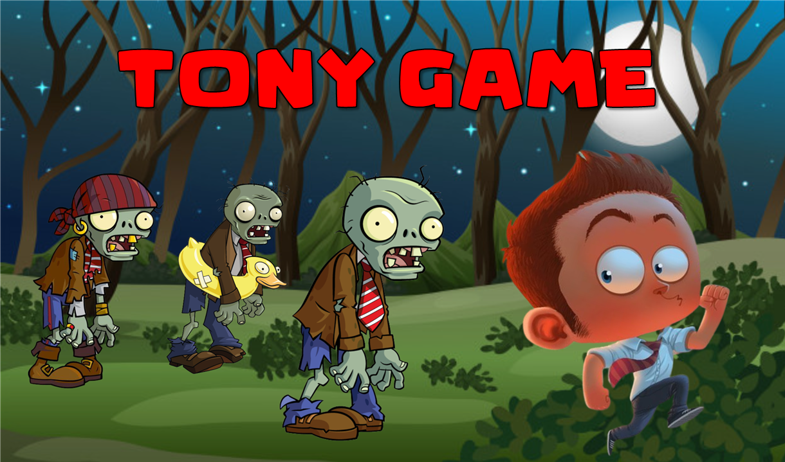

# Tony Game

## Equipo de desarrollo

- Luciano Argolo
- Hernán Pabón

## Capturas

## Reglas de Juego / Instrucciones

Tony debe sobrevivir a los ataques masivos de los zombis, la unica forma que tiene de hacerlo es escapando a través de una cueva y para ello deberá juntar cierta cantidad de monedas golpeando a los zombis que se le acercan! si se te acaba tu nivel de salud, podes usar pociones negras que van dejando algunos zombis para recuperarte! NO AGARRES LAS POSIONES LILA QUE CONTIENEN VENENO!

Controles:
W: Arriba
S: Abajo
D: Derecha
A: Izquierda
X: Pegar (Ataca al Zombi)

## Otros

- Curso/Facultad: Algoritmos 1 - UNSAM
- Versión de wollok: 3.0
- Una vez terminado, no tenemos problemas en que el repositorio sea público / queremos manternerlo privado
